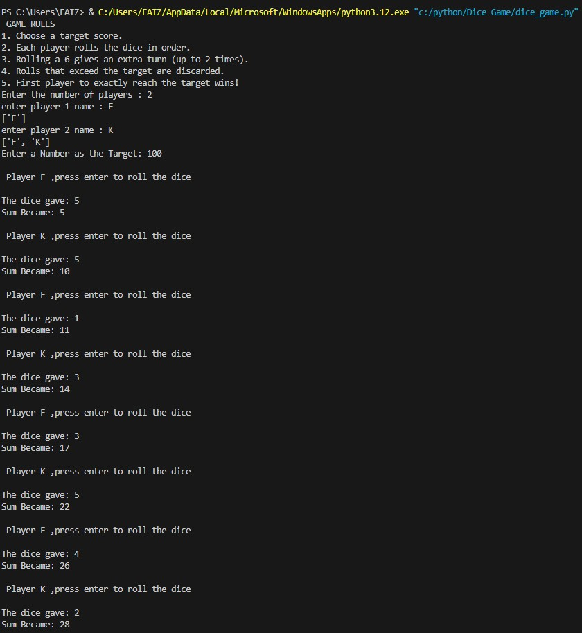

# 🎲 Dice Game - Python (CLI-Based)

A fun and interactive command-line dice game built in Python with unique rules like bonus turns on rolling a 6 and a target score system. Designed for multiple players, this game brings the thrill of dice to your terminal!

## 📌 Game Rules

1.Choose a target score.

2.Enter the number of players and their names.

3.Each player rolls the dice in turns by pressing Enter.

4.Rolling a 6 gives an extra turn (up to 2 extra turns max).

5.If a dice roll exceeds the remaining points to reach the target, it's discarded.

6.The first player to reach the exact target score wins!


## 💻 How to Run

Make sure you have **Python 3.x** installed.  
Then open a terminal and run:

```bash
python dice_game.py

🧠 Features
Multi-player support

Unique "extra turn on rolling 6" logic (max 2 extra turns)

Prevents overshooting the target

Simple replay option after the game ends

Clean and interactive console output

🔧 Tech Stack
Language: Python 3

Module: random (standard library)

🗂️ File Structure
bash
Copy
Edit
Dice-Game/
├── dice_game.py      # Main game script
└── README.md         # Project documentation (this file)

🙋 Author
Mohammad Faiz
B.Tech in Computer Science & Engineering
LinkedIn

🌟 Contributions
Feel free to fork, play, and suggest new features or improvements!

📌 Future Ideas
GUI version using Tkinter

Web version using Flask or Django

High score tracking or leaderboard

🎉 Enjoy the game and let the dice decide your fate!

## 🎮 Game Preview


